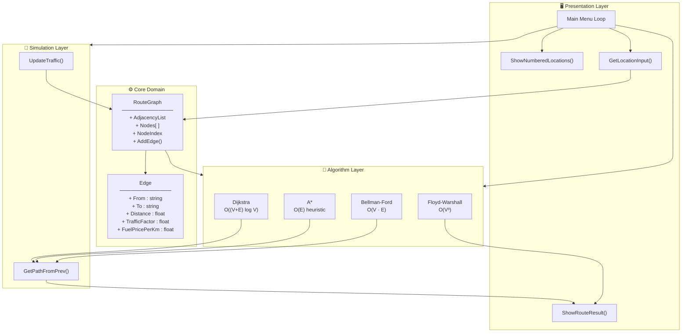
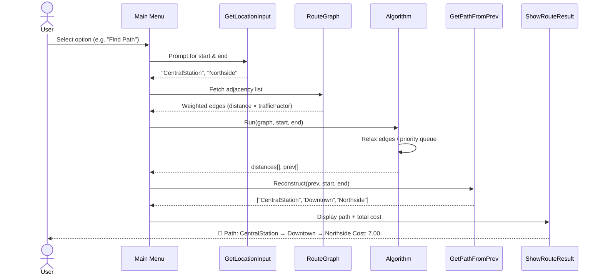
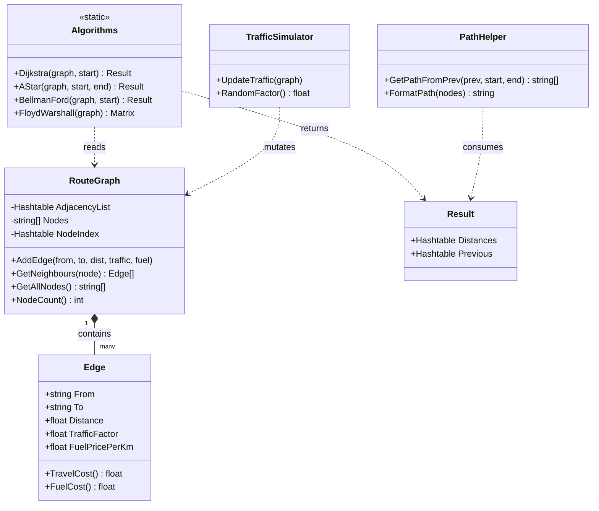
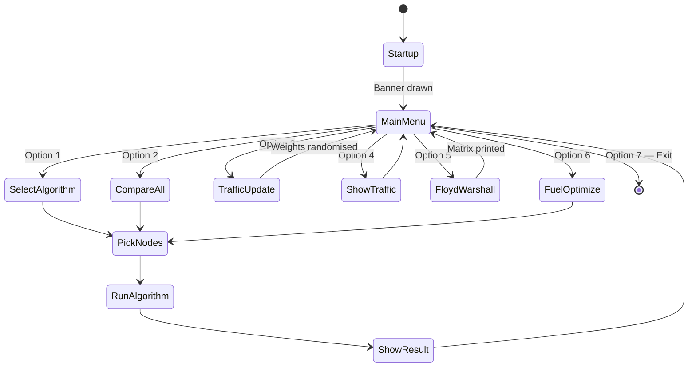
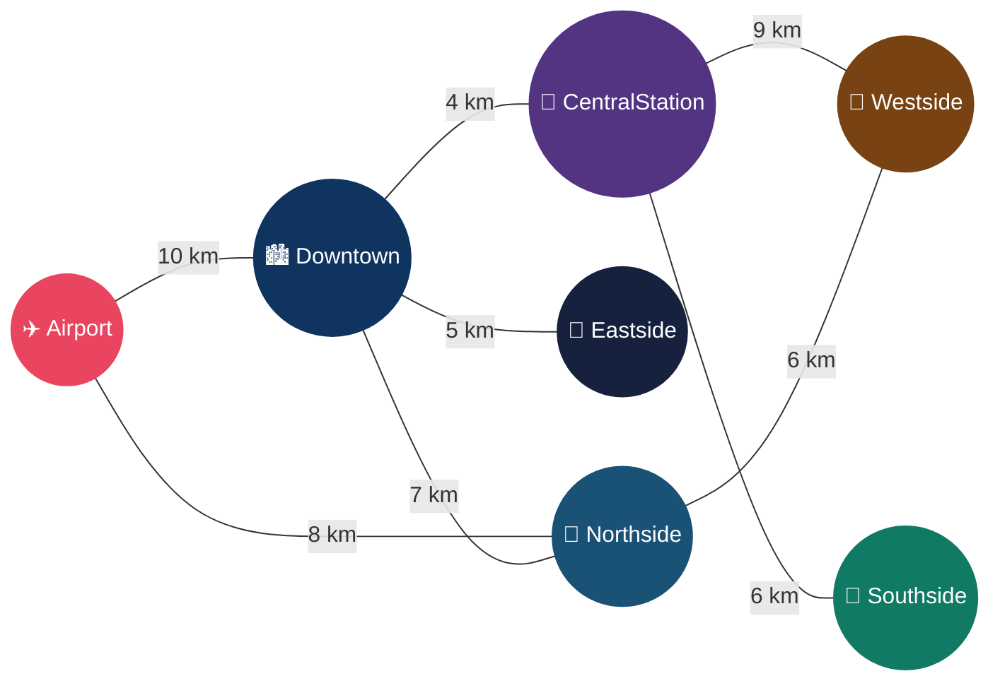
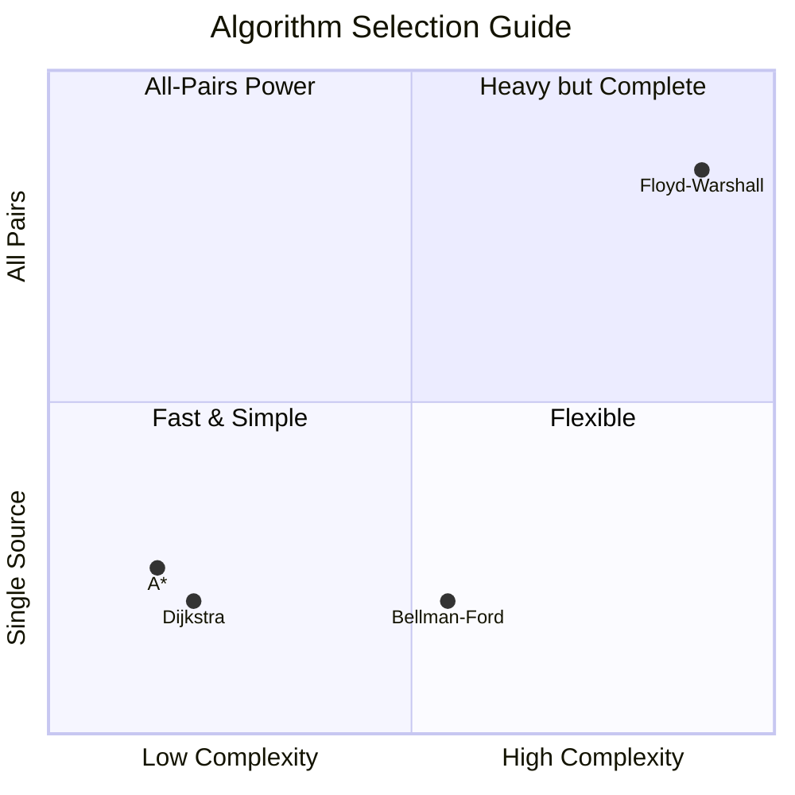
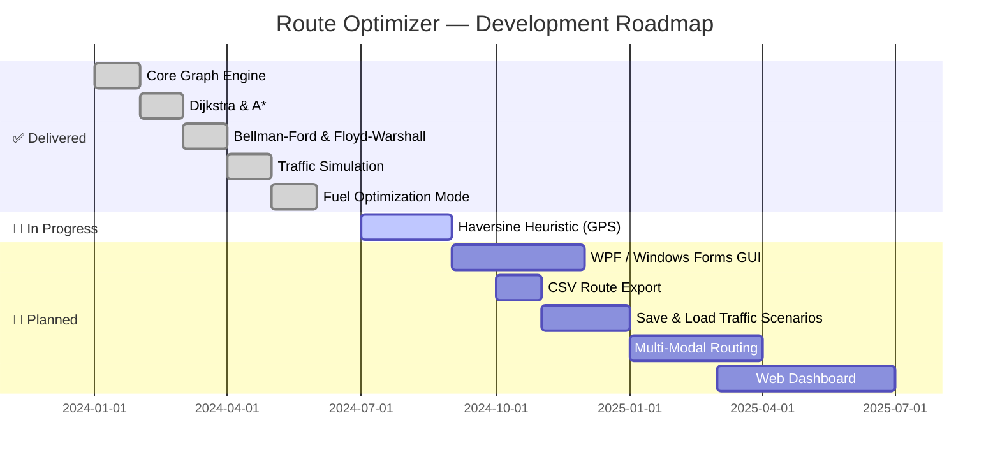

<div align="center">


<br/>


<br/><br/>

[](https://github.com/PowerShell/PowerShell)
[]()
[](LICENSE)
[]()

<br/>

[logV)-f59e0b?style=flat-square&logo=databricks&logoColor=white)]()
[-ec4899?style=flat-square&logo=target&logoColor=white)]()
[-3b82f6?style=flat-square&logo=buffer&logoColor=white)]()
[-8b5cf6?style=flat-square&logo=apachespark&logoColor=white)]()

</div>

---

## 📖 Introduction

**Route Optimization System** is a fully interactive, console-based pathfinding engine written in **PowerShell**. It models a city road network as a weighted undirected graph and exposes four classic shortest-path algorithms — letting you compare their behaviour live, with real-time traffic congestion and monetary fuel-cost optimization baked in.

<div align="center">

</div>

Whether you're a student visualising graph theory, a developer prototyping logistics logic, or just curious how GPS routing software thinks — this project gives you a hands-on, algorithm-level view.

---

## ✨ Feature Highlights

| # | Feature | Detail |
|---|---|---|
| 🚀 | **Four algorithms** | Dijkstra · A\* · Bellman-Ford · Floyd-Warshall |
| 🗺️ | **Interactive menu** | Pick nodes by name **or** by number |
| 🚦 | **Live traffic sim** | Edge weights randomise each round |
| ⛽ | **Fuel optimizer** | Minimize cost, not just time |
| 📊 | **Side-by-side compare** | All single-source algorithms, one run |
| 🔮 | **All-pairs matrix** | Full V×V Floyd-Warshall table |
| 🎨 | **Animated CLI** | Coloured banners, live redraws |

---

## 🏗️ System Architecture

### High-Level Component Diagram



---

### Data Flow — Single Route Query



---

### Class Diagram



---

### State Machine — Menu Lifecycle



---

### City Road Network



---

## 🧠 Algorithm Details



| Algorithm | Complexity | Negative Weights | Negative Cycles | Best Use Case |
|:---:|:---:|:---:|:---:|:---|
| **Dijkstra** | `O((V+E) log V)` | ❌ | ❌ | Standard GPS routing |
| **A\*** | `O(E)` best case | ❌ | ❌ | Heuristic-guided large graphs |
| **Bellman-Ford** | `O(V·E)` | ✅ | Detects | Finance, arbitrage detection |
| **Floyd-Warshall** | `O(V³)` | ✅ | ❌ | Dense graphs, all-pairs view |

> **A\* Heuristic:** Currently `|indexA − indexB| × 0.5`. Replace with `Haversine(coordA, coordB)` for real geographic accuracy.

---

## 🚀 Getting Started

### Prerequisites

```
✅  Windows 10/11  or  Windows Server 2016+
✅  PowerShell 5.1+ (PowerShell 7.x recommended)
✅  Git (optional — for cloning)
```

### Installation

```powershell
# 1 · Clone
git clone https://github.com/LuthandoCandlovu/route-optimizer.git
cd route-optimizer

# 2 · Unblock execution for this session (if needed)
Set-ExecutionPolicy -Scope Process -ExecutionPolicy Bypass

# 3 · Launch
.\RouteOptimizer.ps1
```

### Navigation Quick-Reference

```
[1] Find shortest path      →  choose one algorithm
[2] Compare ALL algorithms  →  Dijkstra + A* + Bellman-Ford side-by-side
[3] Simulate traffic update →  randomise all edge weights
[4] Show traffic & fuel     →  inspect current edge state
[5] Floyd-Warshall matrix   →  full V×V distance table
[6] Fuel optimization       →  minimize monetary cost
[7] Exit
```

---

## 🗺️ Roadmap



---

## 📄 License

Distributed under the **MIT License** — see [`LICENSE`](LICENSE) for details.

---

## 👤 Author

<div align="center">


**Luthando Candlovu**

[](https://github.com/LuthandoCandlovu)

</div>

---

## 🙏 Acknowledgements

- 📘 **CLRS** — *Introduction to Algorithms*, Cormen et al.
- 💻 **PowerShell Community** — scripting patterns and best practices
- 🗺️ **Leaflet.js** — conceptual inspiration for the map-routing interface

---

<div align="center">


<br/>

*Found this useful? Drop a ⭐ — it genuinely helps!*

[](https://github.com/LuthandoCandlovu/route-optimizer)
[](https://github.com/LuthandoCandlovu/route-optimizer/fork)
[](https://github.com/LuthandoCandlovu/route-optimizer)

</div>
